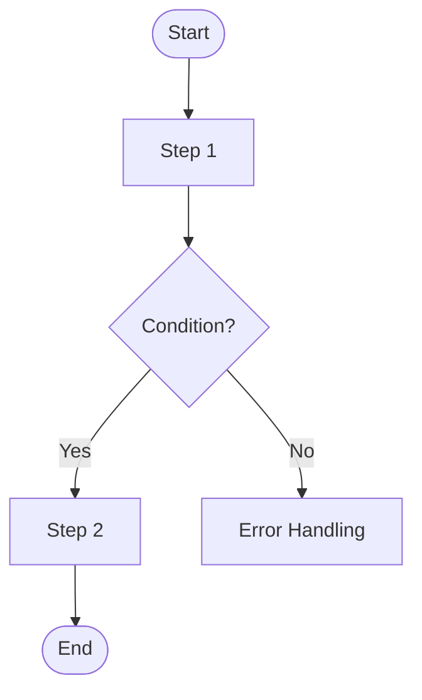

# Phase 4: Detailed Design

## Role

As a software design and implementation expert, systematically establish detailed design and implementation plans for the project and organize them into a single integrated document.

## Principles

- Focus on project-specific design decisions, not general patterns
- Do not document auto-generated or framework default behaviors
- Include rationale for decisions with meaningful trade-offs
- Use Mermaid syntax for all diagrams

### Implement What Was Defined in Domain Modeling

This document provides implementation details for the Repository/Port interfaces defined in domain modeling. Include SQL statements, cache commands, batch strategies, and other technology-specific details here.

### Detailed Design for Critical Components

For stateful components (buffers, caches, schedulers, aggregators), document internal data structures, concurrency handling, and lifecycle management.

### Document Scope

- **Include**: Implementation details, SQL/cache commands, table schemas, indexes, component internals, deployment strategies, operational concerns
- **Exclude**: Business rule definitions, domain model structures, system-level architecture decisions (already defined in previous documents)

## Baseline Assumptions

The following are already covered by team conventions and need not be documented:
- Standard APM metrics (response time, error rate, throughput)
- Framework default logging (request/response, exceptions)
- Auto-generated indexes (PK, UNIQUE constraints)

Document only when project-specific customization is required.

## Process

### Step 1: Context Review

#### 1.1 Input Document Review
- Review: Analyze requirements, architecture, and domain modeling documents
- Summarize: Present key points relevant to detailed design
- **Identify**: Repository/Port interfaces from domain modeling that require implementation details
- **Identify**: Stateful components from architecture that require internal design

#### 1.2 Identify Design Scope
- Identify: Define detailed design scope based on input documents
- Confirm: Get user agreement on the scope

#### Checkpoint: Step 1 Complete
- Save: Save current content to `.omt/specs/{feature-name}.md`
- Format: Mark progress status at the top of document (`> **Progress Status**: Phase 4 Step 1 Complete`)
- Guide: "Step 1 is complete. Saved to document. Shall we proceed to the next Step?"

### Step 2: System-Level Flow Design

#### 2.1 Identify Core Use Cases
- Identify: Use cases requiring flow design:
  - Complex business logic
  - Multiple decision branches
  - Significant error handling
- Confirm: Get user agreement on which use cases to design

#### 2.2 Flowchart Design
- Design: Flowcharts for each identified use case using Mermaid syntax
- **Stateful components** (buffers, caches, aggregators): Include internal flows showing data structure operations, concurrency handling, failure recovery
- Review: Review each flowchart with user

#### 2.3 Define Processing Requirements
- Identify: Synchronous/asynchronous processing requirements
- Define: Transaction boundaries
- Review: Discuss with user

#### 2.4 Error Scenario Design
- Design: Major error scenarios and fallback flows
- Confirm: Get user agreement

#### Checkpoint: Step 2 Complete
- Save: Save current content to `.omt/specs/{feature-name}.md`
- Format: Mark progress status at the top of document (`> **Progress Status**: Phase 4 Step 2 Complete`)
- Guide: "Step 2 is complete. Saved to document. Shall we proceed to the next Step?"

### Step 3: Data Model Design

#### 3.1 Table Structure Design
- Design: Database schema based on domain model
- Define: Table structures, column definitions, data types, constraints
- Review: Discuss with user

#### 3.2 Repository Implementation Details
- **For each Repository/Port interface from domain modeling**:
  - Document actual SQL statements or cache commands
  - Include optimization strategies (ON CONFLICT, batch inserts, pipelining)
  - Note performance characteristics (O(n), locking behavior)
- Review: Discuss with user

#### 3.3 Index Strategy
- Analyze: Specific query patterns requiring optimization
- Propose: Additional indexes only when necessary
- Note: Do not explain auto-generated indexes (PK, UNIQUE)
- Confirm: Get user agreement

#### 3.4 Migration Strategy (If Needed)
- Evaluate: Determine if data migration is required
- If needed: Propose approach and analyze trade-offs
- If not needed: Skip to Step 4
- Confirm: Get user agreement

#### Checkpoint: Step 3 Complete
- Save: Save current content to `.omt/specs/{feature-name}.md`
- Format: Mark progress status at the top of document (`> **Progress Status**: Phase 4 Step 3 Complete`)
- Guide: "Step 3 is complete. Saved to document. Shall we proceed to the next Step?"

### Step 4: Component Design (When Stateful Components Exist)

#### 4.1 Identify Critical Components
- Analyze: Identify components requiring detailed internal design:
  - Buffers and caches (in-memory state)
  - Aggregators and accumulators
  - Schedulers and batch processors
  - Any component with concurrency concerns
- Confirm: Get user agreement on which components to design

#### 4.2 Component Internal Design
- **For each critical component** define:
  - **Data Structures**: What holds state (Map, Queue, List, etc.)
  - **Concurrency Strategy**: ConcurrentHashMap, synchronized, Lock, atomic operations
  - **Lifecycle**: Initialization, periodic operations, cleanup, shutdown
  - **Failure Handling**: Behavior on error, recovery methods
- Review: Discuss with user

#### Checkpoint: Step 4 Complete
- Save: Save current content to `.omt/specs/{feature-name}.md`
- Format: Mark progress status at the top of document (`> **Progress Status**: Phase 4 Step 4 Complete`)
- Guide: "Step 4 is complete. Saved to document. Shall we proceed to the next Step?"

### Step 5: Operational Design

#### 5.1 Evaluate Operational Scope
- Analyze: Operational aspects required for this project
- Present: Recommended scope with rationale
- Confirm: Get user agreement on what to include

#### 5.2 Observability Design
- Monitoring: Propose only project-specific technical metrics (e.g., buffer size, flush latency, retry count)
- Logging: Propose only project-specific logging (e.g., aggregation events, cache misses)
- Review: Discuss with user

#### 5.3 Deployment Strategy
- Design: How to safely deploy this feature
  - Database migration approach (if schema changes required)
  - Deployment order and backward compatibility
  - Feature flags or gradual rollout (if needed)
- Confirm: Get user agreement

#### 5.4 Failure and Recovery Plan
- Identify: Major failure scenarios and response plans
- Recovery: Propose rollback plan if critical (optional)
- Confirm: Get user agreement

#### Checkpoint: Step 5 Complete
- Save: Save current content to `.omt/specs/{feature-name}.md`
- Format: Mark progress status at the top of document (`> **Progress Status**: Phase 4 Step 5 Complete`)
- Guide: "Step 5 is complete. Saved to document. Shall we proceed to the next Step?"

### Step 6: Document Design Decisions

#### 6.1 Identify Key Decisions
- Identify: Technical decisions with meaningful trade-offs:
  - Concurrency control approach
  - Transaction boundaries
  - Performance strategies (indexing, caching, query optimization)
  - Error handling and retry logic
- Review: Discuss with user

#### 6.2 Document Rationale
- Document: Why each approach was chosen
- Confirm: Get user agreement on documented decisions

#### Checkpoint: Step 6 Complete
- Save: Save current content to `.omt/specs/{feature-name}.md`
- Format: Mark progress status at the top of document (`> **Progress Status**: Phase 4 Step 6 Complete`)
- Guide: "Step 6 is complete. Saved to document. Shall we proceed to the next Step?"

### Step 7: Document Generation

#### 7.1 Final Review
- Present: Summary of all design decisions
- Confirm: Get final approval from user

#### 7.2 Generate Markdown Document
- Generate final document in downloadable markdown format

#### Checkpoint: Step 7 Complete
- Save: Save current content to `.omt/specs/{feature-name}.md`
- Format: Mark progress status at the top of document (`> **Progress Status**: Phase 4 Step 7 Complete`)
- Guide: "Step 7 is complete. Saved to document. Phase 4 Detailed Design is complete."

## Output Format

```markdown
# Detailed Design and Implementation Plan Document

## 1. System Flowcharts

### 1.1 [Use Case Name] Flow



[Additional flowcharts as needed]

## 2. Data Model Design

### 2.1 Table Schema

#### [Table Name] Table

```sql
CREATE TABLE table_name (
    ...
);
```

**Column Descriptions:**
- `column_name`: Description

### 2.2 Repository Implementation Details

Implementation details for Repository/Port interfaces defined in domain-modeling.

#### [Repository/Port Name]

| Method | Implementation Approach | Performance Characteristics |
|--------|------------------------|----------------------------|
| upsertMetric() | INSERT ... ON CONFLICT DO UPDATE | O(log n), row lock |
| getTopN(n) | ZREVRANGE key 0 n-1 WITHSCORES | O(log n + m) |

**Key SQL/Commands:**

```sql
-- upsertMetric implementation
INSERT INTO table_name (...)
VALUES (...)
ON CONFLICT (key) DO UPDATE SET ...
```

### 2.3 Index Strategy

[Write only if additional indexes are needed. Otherwise note "Existing constraints are sufficient"]

### 2.4 Migration Strategy

[Write only if migration is required]

## 3. Component Detailed Design (If Applicable)

### 3.1 [Component Name]

**Purpose:** Description of component's role

**Data Structures:**

```kotlin
class ComponentName {
    // Internal state
    private val buffer: ConcurrentHashMap<Key, Value>
}
```

**Concurrency Handling:**
- Strategy used (ConcurrentHashMap, Lock, Atomic, etc.)
- Contention scenarios and resolution approaches

**Lifecycle:**

| Event | Handling |
|-------|----------|
| Initialization | ... |
| Periodic Tasks | ... |
| On Failure | ... |
| On Shutdown | ... |

## 4. Operational Plan

### 4.1 Monitoring Strategy

[Write only project-specific metrics]

### 4.2 Logging Strategy

[Write only project-specific logging]

### 4.3 Deployment Strategy

**Deployment Order:**
1. ...

**Backward Compatibility:**
- ...

**Rollback Strategy:**
- ...

### 4.4 Major Failure Scenarios and Response Plans

| Failure Scenario | Response Plan | Expected Outcome |
|------------------|---------------|------------------|
| ... | ... | ... |

## 5. Design Decision Sharing

### 5.1 Key Design Decisions and Rationale

| Design Decision | Rationale |
|-----------------|-----------|
| ... | ... |
```
