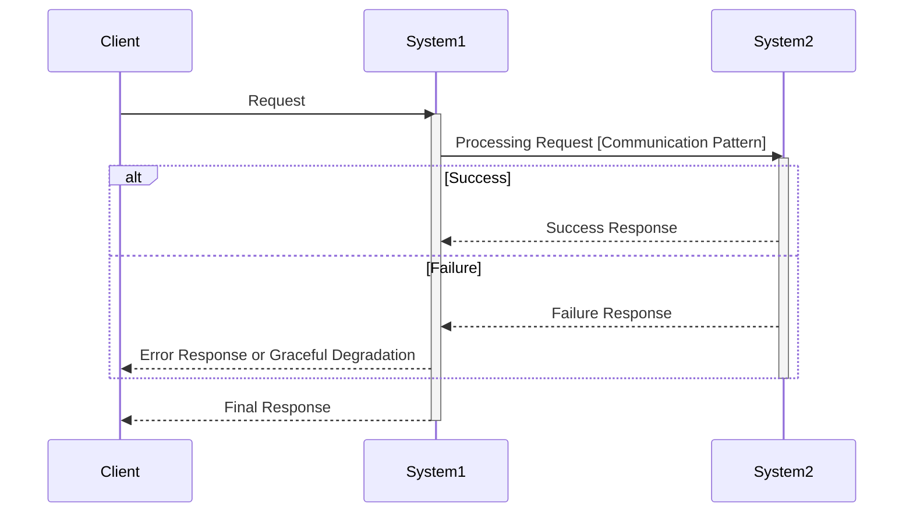
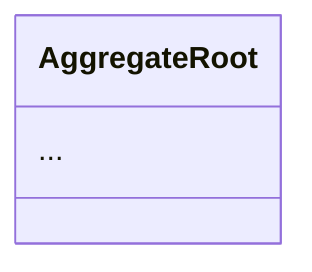
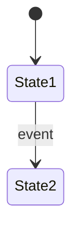
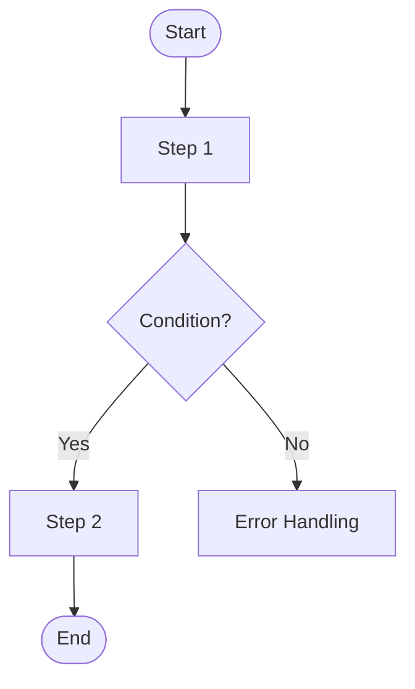

# Phase Output Formats

Output format templates for each phase of the spec skill.

---

## Phase 1: Requirements Analysis

```markdown
# Requirements Analysis Document: [Project Name]

## 1. Project Overview

### 1.1 Problem to Solve
[Description of the core problem this project aims to solve]

### 1.2 Project Objectives
[Description of project objectives and expected business value]

### 1.3 Expected Benefits
[Description of expected benefits and success metrics]

### 1.4 Project Completion Criteria
This project is considered complete when all of the following conditions are satisfied.
First, ... Second, ... Third, ...

---

## 2. Domain Glossary

| Term | Definition |
|-----|-----|
| ... | ... |

### 2.1 User Action Definitions
[Include only if the system tracks user actions]

**[Action Name]:** [When it occurs], [How duplicates are handled], [Behavior on cancellation]

### 2.2 Business Rules

**[Rule Name]:**
[Rule description in clear prose. Include business rationale - why this rule exists.]

**Example:**
[Specific example with numbers illustrating the rule]

---

## 3. Primary Users and Goals

### 3.1 [User Type 1]
[User goals described in prose]

### 3.2 [User Type 2]
[User goals described in prose]

---

## 4. Use Case Specifications

### US-1: [Use Case Name]

**User Story:**
[As-Want-So that format, written in prose]

**Acceptance Criteria:**
1. [Testable condition]
2. [Testable condition]
3. ...

**Exception Scenarios:**
1. [Error condition and expected system behavior]
2. ...

[If no error cases: "N/A: [specific reason]"]

---

## 5. Non-Functional Requirements

### 5.1 [Requirement Category]
[Requirement description in prose, followed by verification criteria]

**Verification Criteria:** [Specific, measurable criteria]

---

## 6. Validation Scenarios

### 6.1 [Scenario Name]
[E2E scenario with specific numbers and expected results. Should read like a test case.]

### 6.2 [Scenario Name]
[Additional scenarios covering edge cases, time-based behavior, etc.]
```

---

## Phase 2: Architecture Design

```markdown
# Solution Design Document

## 1. Design Context

### 1.1 Core Challenges to Solve
- Summary of core problems to solve
- Business/technical requirements

### 1.2 Current Architecture Impact
- Relevant current system structure
- Existing system characteristics affecting the solution

### 1.3 Technology Stack Overview
- Technology stack being utilized

## 2. Solution Alternative Analysis

### Alternative 1: [Alternative Name]
- **Description**: Description of the solution approach
- **Problem Resolution**: How it meets the requirements
- **Pros**:
  - Pro 1
  - Pro 2
- **Cons**:
  - Con 1
  - Con 2
- **Architecture Impact**: Impact on existing systems

[Repeat for Alternative 2, 3 if needed]

## 3. Selected Solution

### 3.1 Decision Summary
- Brief description of the selected solution
- Reasons for the decision (with clear rationale)

### 3.2 Solution Structure

#### Core Architecture Components

**1. [System Name]**
- Responsibility 1
- Responsibility 2
- Responsibility 3

#### Data Flow

**1. [Use Case Name] Flow**



### 3.3 Inter-system Integration

| Integration Point | Communication Pattern | Sync/Async | Failure Handling | Rationale |
|-------------------|----------------------|------------|------------------|-----------|
| A -> B | Function Call (in-process) | Sync | Graceful Degradation | Same module, minimize latency |
| A -> C | Kafka | Async | Retry 3x + DLQ | Service separation, ordering required |
| A -> D | HTTP | Sync | Timeout with Fallback | Separate service, real-time response needed |

### 3.4 Data Consistency Policy (if applicable)

| Storage Relationship | Source of Truth | Consistency Policy | Rationale |
|---------------------|-----------------|-------------------|-----------|
| RDB <-> Cache | RDB | Ignore cache failures, periodic sync | Approximation acceptable |

### 3.5 Transaction Boundaries (if applicable)

| Operation | Transaction Scope | Pattern | Notes |
|-----------|------------------|---------|-------|
| ... | ... | Single DB / Outbox / Saga | ... |

### 3.6 Event Contracts (for event-driven integration)

**Consumed Events:**

| Event Name | Required Fields | Publisher |
|------------|-----------------|-----------|
| ... | ... | ... |

**Published Events:**

| Event Name | Required Fields | Consumer |
|------------|-----------------|----------|
| ... | ... | ... |
```

---

## Phase 3: Domain Modeling

```markdown
# Domain Modeling Document

## 1. Class Diagram



### Key Structure
- Aggregate composition and responsibilities
- Design intent and reference relationship explanation

### Value Object Invariants

| Value Object | Invariant | Notes |
|-------------|-----------|-------|
| Money | amount >= 0 | Constructor validation |
| ... | ... | ... |

### Repository/Port Interfaces

Define operations needed from domain perspective in business terms. For implementation details (SQL, cache commands, etc.), refer to detailed-design.

**[Repository/Port Name]**

| Method | Business Meaning |
|--------|-----------------|
| save(entity) | Save entity |
| findById(id) | Find by ID |
| ... | ... |

## 2. Domain Rules

### 2.1 [Rule Category Name]
- Rule 1
- Rule 2

### 2.2 [Rule Category Name]
- Rule 1
- Rule 2

[Use table format for calculation logic]

| Condition | Calculation Method | Example |
|-----------|-------------------|---------|
| ... | ... | ... |

### 2.X Domain Service Usage Rules (if multiple methods exist)

**[Service Name] Method Relationships**

| Situation | Method to Use | Description |
|-----------|--------------|-------------|
| ... | ... | ... |

## 3. State Diagram



### State Transition Rules

| Current State | Event | Next State | Transition Condition | Side Effects |
|--------------|-------|------------|---------------------|--------------|
| ... | ... | ... | ... | ... |

## 4. Domain Events

### Current Usage Status
[Used/Not used with clear reasoning]

### Event List (if used)

**Publisher Side**:

| Event Name | Publisher | Trigger Condition |
|------------|-----------|------------------|
| OrderCreatedEvent | OrderService | After successful order creation |

**Consumer Side**:

| Event Name | Consumer | Processing Content |
|------------|----------|-------------------|
| OrderCreatedEvent | NotificationEventListener | Delegates to NotificationService.sendOrderConfirmation() |

**Payload**:

| Event Name | Fields | Description |
|------------|--------|-------------|
| OrderCreatedEvent | orderId, customerId, totalAmount, occuredAt | Order identification and basic information |

Note: Publishing and consuming can be developed/tested/deployed independently. The event payload is the contract connecting them.

### Potential Future Events (if not used)
- Event 1: Timing/conditions for introduction
- Event 2: Timing/conditions for introduction
```

---

## Phase 4: Detailed Design

```markdown
# Detailed Design and Implementation Plan Document

## 1. System Flowcharts

### 1.1 [Use Case Name] Flow



[Additional flowcharts as needed]

## 2. Data Model Design

### 2.1 Table Schema

#### [Table Name] Table

```sql
CREATE TABLE table_name (
    ...
);
```

**Column Descriptions:**
- `column_name`: Description

### 2.2 Repository Implementation Details

Implementation details for Repository/Port interfaces defined in domain-modeling.

#### [Repository/Port Name]

| Method | Implementation Approach | Performance Characteristics |
|--------|------------------------|----------------------------|
| upsertMetric() | INSERT ... ON CONFLICT DO UPDATE | O(log n), row lock |
| getTopN(n) | ZREVRANGE key 0 n-1 WITHSCORES | O(log n + m) |

**Key SQL/Commands:**

```sql
-- upsertMetric implementation
INSERT INTO table_name (...)
VALUES (...)
ON CONFLICT (key) DO UPDATE SET ...
```

### 2.3 Index Strategy

[Write only if additional indexes are needed. Otherwise note "Existing constraints are sufficient"]

### 2.4 Migration Strategy

[Write only if migration is required]

## 3. Component Detailed Design (If Applicable)

### 3.1 [Component Name]

**Purpose:** Description of component's role

**Data Structures:**

```kotlin
class ComponentName {
    // Internal state
    private val buffer: ConcurrentHashMap<Key, Value>
}
```

**Concurrency Handling:**
- Strategy used (ConcurrentHashMap, Lock, Atomic, etc.)
- Contention scenarios and resolution approaches

**Lifecycle:**

| Event | Handling |
|-------|----------|
| Initialization | ... |
| Periodic Tasks | ... |
| On Failure | ... |
| On Shutdown | ... |

## 4. Operational Plan

### 4.1 Monitoring Strategy

[Write only project-specific metrics]

### 4.2 Logging Strategy

[Write only project-specific logging]

### 4.3 Deployment Strategy

**Deployment Order:**
1. ...

**Backward Compatibility:**
- ...

**Rollback Strategy:**
- ...

### 4.4 Major Failure Scenarios and Response Plans

| Failure Scenario | Response Plan | Expected Outcome |
|------------------|---------------|------------------|
| ... | ... | ... |

## 5. Design Decision Sharing

### 5.1 Key Design Decisions and Rationale

| Design Decision | Rationale |
|-----------------|-----------|
| ... | ... |
```

---

## Phase 5: API Design

```markdown
# API Design Decisions

## 1. Key Design Decisions and Background

### 1.1 Business Context
[Core problems, solution objectives, business requirements addressed by the API]

### 1.2 Major Design Decisions
[Major API design decisions and their rationale]

## 2. API Specifications

### 2.1 [API Name]

**Endpoint**: `[HTTP Method] [Path]`

**Description**: [API function description]

**Request**:
```
[Request parameters or body structure]
```

**Response**:
```json
{
  "field": "value"
}
```

**Business Rules**:
- [Rule 1]
- [Rule 2]

**Error Cases**:

| Condition | HTTP Status | Error Code | Message |
|-----------|-------------|------------|---------|
| ... | ... | ... | ... |

[Repeat for additional APIs as needed]

## 3. API Changes

### 3.1 APIs Being Added

| HTTP Method | Path | Description | Impact |
|-------------|------|-------------|--------|
| ... | ... | ... | ... |

### 3.2 APIs Being Modified (if applicable)

- **Target**: [HTTP Method] [Path]
- **Change Type**: [Field addition/removal/modification, path change, etc.]
- **Change Details**: [Specific change details]
- **Reason for Change**: [Background and reason for change]
- **Backward Compatibility**: [Maintained/Broken]
- **Migration Period**: [Specify if needed]

### 3.3 Deleted/Deprecated APIs (if applicable)

- **Target API**: [HTTP Method] [Path]
- **Action**: [Deletion/Deprecation]
- **Reason**: [Reason for action]
- **Replacement API**: [If a replacement API exists]
- **End of Support Date**: [Date]
```

---

## Phase 6: Wrap-up

Phase 6 produces context files rather than a single output document. See `references/protocols.md` for context file formats:

- `project.md` - Tech stack, constraints, team values
- `conventions.md` - Established patterns
- `decisions.md` - ADR-format decision records
- `gotchas.md` - Known pitfalls to avoid
